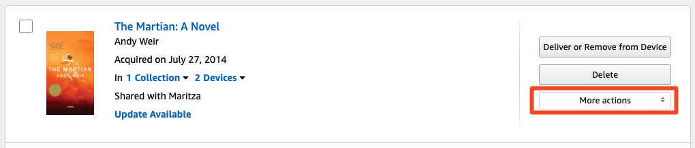
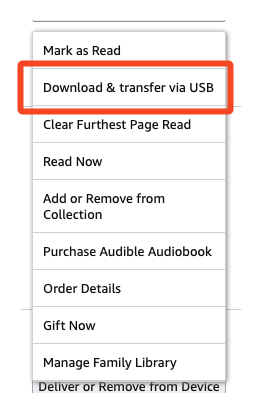
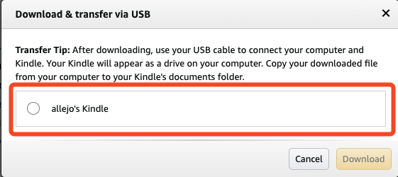
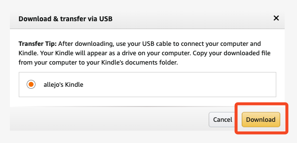

# How to semi-automate downloading your ebooks from Amazon

I recently found myself in a position of aggregating all of my ebooks into a single location using Calibre. I had finished importing all of my ebooks from other stores and sources. All that was left was my Kindle ebook collection; I have approximately 300 books in my Amazon library. Here's the process of downloading your ebooks so that you can import them into Calibre.

1. Visit [your Amazon Digital Library](https://www.amazon.com/hz/mycd/digital-console/contentlist/booksAll/dateAsc/?pageNumber=1).
2. Find the book you want to download and click "More actions"
   
3. Click "Download & transfer via USB"
   
4. Select your Kindle
   
5. Hit "Download" and wait for it to start downloading
   

I don't know about you but as I was not particularly thrilled with the thought of doing this process 300 times to download all of my books. I'm a programmer, I will over complicate things and automate things that probably don't need to be automated. But here you are, reading along because you've thought, "there has to be an easier way to this."

The answer is: there is a _better_ way of automating this but it's not perfect. But unless someone wants to build something better or sponsor me to write something better, here's my hacky approach.

## Full Code Snippet        

```javascript
const delay = ms => new Promise(res => setTimeout(res, ms * 1000));
const DEVICE_ID = '0';
const moreActionsButtons = document.querySelectorAll('[id="MORE_ACTION:false"]');

for (let i = 0; i < moreActionsButtons.length; i++) {
    const button = moreActionsButtons[i];
    button.click();

    await delay(1);

    const downloadButton = button.querySelector('[id^="DOWNLOAD_AND_TRANSFER_ACTION_"]'); // DOWNLOAD_AND_TRANSFER_ACTION_B0CVR44GDZ
    downloadButton.click(); 

    await delay(1);

    const buttonUID = downloadButton.id.replace('DOWNLOAD_AND_TRANSFER_ACTION_', ''); // B0CVR44GDZ
    const selectDevice = document.querySelector(`[id^="download_and_transfer_list_${buttonUID}_${DEVICE_ID}"]`);
    selectDevice.click();

    await delay(1);

    const dlButton = document.querySelector(`[id^="DOWNLOAD_AND_TRANSFER_ACTION_${buttonUID}_CONFIRM"]`);
    dlButton.click();

    await delay(2);

    const closeNotification = document.querySelector('#notification-close');

    if (closeNotification) {
        closeNotification.click();
    }

    await delay(10);
}
```
