For years, I had been in search for the "perfect e-ink reader" that met all of my niche needs/wants. I wanted something with an integration to [calibre](https://calibre-ebook.com/), be able to download and read RSS feeds, and lastly, be able to connect to cloud storage such as Google Drive where I host my PDFs. These seem like a niche set of features, and honestly, they are. However, this is what I've always wanted. I did my research and evaluated many e-ink readers; e.g. Boox, Kobo, a new Kindle, Nook, ReMarkable, and others. None of them checked all the boxes and all came with extreme vendor lock-in or had virtually no developer community behind it. Sure, I've got an iPad that can accomplish all those features and more, but an iPad has a lot more functionality than I need when I just want to read without distractions.

I recently discovered the Kindle jailbreaking community and was reminded of my teen years where I was active in the iOS jailbreaking community. The level of freedom I had over my device at the time was something I would love to have over my Kindle. With Amazon recently running [a big book sale that "coincidentally" overlapped with Independent Bookstore Day](https://techcrunch.com/2025/04/26/amazons-big-book-sale-just-happens-to-overlap-with-independent-bookstore-day/?guccounter=1), I decided it was time to say "fuck you" to Amazon and part ways as much as I can.

## Why am I jailbreaking my Kindle?

I have recently worked long hours in organizing _all_ of my ebooks into a single library with calibre with the goal of being able to easily sync my Kindle with my books. Here's the difficult part, for years I had been buying ebooks from Amazon and while they did make the ecosystem incredibly user-friendly for the majority of the population, I felt nothing but limited due to the following:

1. As of February 26, 2025, Amazon has stopped supporting the "Download & Transfer via USB" functionality. This means, it is now incredibly more tedious for you to be able to download copies of the ebooks that **you** have bought. In the past, I have had Amazon delist ebooks from their online stores and in turn, I lost it from my Kindle since I can't search for it anymore. Thankfully, I was in the habit of always downloading a copy of those ebooks but what if I hadn't? I might have lost that digital book even though I **bought** it.
2. I never thought this is something I would be writing this but with the direction my country, the United States, is heading regarding censorship, I did not want to remain at the mercy of Amazon to dictate which books that I've **purchased** I'm still allowed to read.
3. The only way I can transfer books to my Kindle wirelessly is by emailing the file to my Kindle email, which is handled by Amazon. What's stopping Amazon from censoring the books I send to them to deliver to my Kindle.
4. My Kindle Paperwhite 3rd generation from 2015 is considered "end of life," meaning I no longer receive updates from Amazon. According to Amazon, my Kindle is considered no different than a paperweight. Why would I trade in, my perfectly functional and in good condition device for a new device that has even more restrictions placed on it? It's just wasteful consumerism if you ask me. If Amazon won't continue developing for my Kindle, let's turn to the open source community of nerds that will.

Fuck Amazon! Let's jailbreak my 7th generation 2015 Kindle Paperwhite (aka `PW3`).

## The Jailbreaking Process

First off, the jailbreaking process is nowhere near as simple as it was with my iOS days, where you could just download an app on your computer, press a single button, and wait. That's not to say that it's difficult or impossible either, it's just a move involved process. A lot very smart nerds who felt the same way about breathing new life into their abandoned devices, have put in a lot of work into simplifying the process as much as possible.

Thank you to the awesome community behind [Kindle Modding](https://kindlemodding.org/) for writing all of the tutorials and documentation I used to jailbreak my Kindle. This would not have been possible without [HackerDude](https://www.mobileread.com/forums/member.php?u=330416)'s WinterBreak exploit that I was able to get working.

### The Prerequisites

- A computer; it's not possbile to jailbreak your Kindle just from the device itself
- Your Kindle **must** be registered with Amazon (unfortunately)
- You must have a saved Wi-Fi connection on your Kindle, and be ready to connect to that Wi-Fi during the jailbreaking process

### Run the Jailbreak Exploit

The first step is to actually run an exploit allowing us to remove security restrictions on the Kindle; this is known as "jailbreaking."

1. I downloaded the [latest release of the WinterBreak jailbreak](https://github.com/KindleModding/WinterBreak/releases/latest/download/WinterBreak.tar.gz)
2. Turn on Airplane mode
3. Reboot Kindle
4. After rebooting, connect the Kindle to the computer. Extract WinterBreak and copy over the contents onto the Kindle (including the hidden dot files!). Replace any files that may already exist
5. Eject Kindle from the computer
6. Open the Kindle Store by clicking on the cart. It'll prompt you to disable Airplane mode, do it. Once the store loads, the Mesquito hack will be displayed. Click to run it.
   <div class="c-image-gallery" markdown="1">
   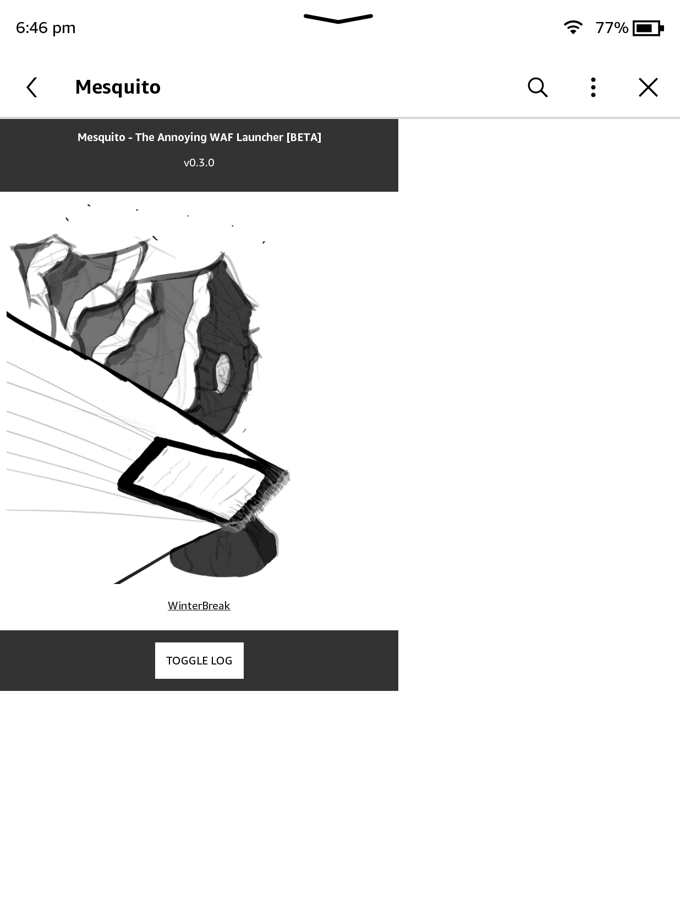
   </div>
7. Wait for a few seconds and then console text will appear in the upper left corner of the display. At this point, turn airplane mode back on and install the hotfix to persist this jailbreak across reboots.
   <div class="c-image-gallery" markdown="1">
   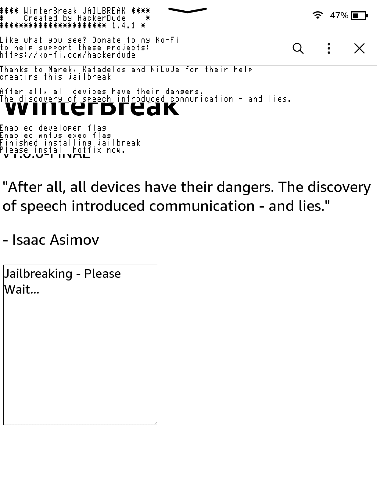
   </div>

### Persisting the Jailbreak (aka "Installing the Hotfix")

The next step is to persist this jailbreak across reboots and updates; a Kindle update referred to as a "hotfix" is needed to accomplish this.

1. Download the [update `.bin` file from GitHub](https://github.com/KindleModding/Hotfix/releases/latest/download/Update\_hotfix\_universal.bin), this file is what's known as the "hotfix."
2. Plug in the Kindle and copy the `.bin` file to the root of the device. If there are any other `.bin` files on the device already, delete them first.
3. Go to your Kindle settings, then click the three dot menu, and select "Update your Kindle." Confirm the installation.
   <div class="c-image-gallery" markdown="1">
   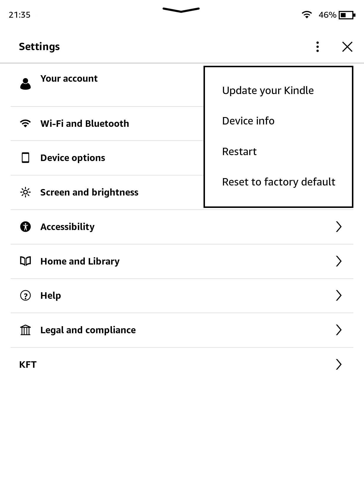
   </div>
4. After the Kindle has rebooted, the hotfix is now installed and needs to be executed on the device. A new "ebook" is displayed in your device's library called "Run Hotfix." Open that book to run the process.
5. Do **not** delete the hotfix eBook, it is necessary to run it every time there's an update

### Install KUAL and MRPI

Now that our Kindle is officially jailbroken, we can run whatever code or applications we want. Similarly to how the hotfix in the previous step created a fake "ebook," that when opened, executed code; we need to do the same for our other applications so that we can launch them from the Kindle UI. This is where the Kindle Unified Application Launcher, or KUAL, comes in to solve that need.

1. Download [KUAL for devices released in 2012 or after](https://kindlemodding.org/jailbreaking/post-jailbreak/installing-kual-mrpi/Update\_KUALBooklet\_ALLDEVICES\_KS2\_install.bin) or [KUAL for legacy devices (pre-2012)](https://storage.gra.cloud.ovh.net/v1/AUTH\_2ac4bfee353948ec8ea7fd1710574097/mr-public/KUAL/KUAL-v2.7.37-gfcb45b5-20250419.tar.xz).   
2. Download [MobileRead Package Installer (MRPI)](https://fw.notmarek.com/khf/kual-mrinstaller-khf.tar.xz) so that will simplify installing update packages (remember the `.bin` file in the previous step?)
3. Connect your Kindle to your computer
4. Extract the MRPI contents and copy over/merge the `extensions` and `mrpackages` folders to your Kindle
5. Copy over the KUAL `.bin` file to the root of the device
6. Eject and unplug your Kindle
7. In the Kindle's search bar, type `;log mrpi`
8. Go to your Kindle settings, then click the three dot menu, and select "Update your Kindle." Confirm the installation.
9. After your Kindle reboots, there should be a KUAL eBook located in your library.

### Disable OTA Updates

My Kindle Paperwhite 3rd gen is EOL and no longer receives updates, but just in case, let's disable OTA anyways to be safe. My Kindle is stuck at firmware 5.16.2.1.1 so I need to install `renameotabin`.

1. Download [`renameotabin`](https://www.mobileread.com/forums/showpost.php?p=4076733\&postcount=25)
2. Connect the Kindle to your computer and copy the `renameotabin` folder into the `extensions` folder.
3. Eject and unplug the Kindle
4. Open the KUAL eBook and select "Rename OTA Binaries" from the menu. Then proceed to select "Rename."
   1. If you need to restore, downgrade, or otherwise manage my Kindle through official methods, select `Restore` before being able to do anything

### Restoring the Store

I'm not sure how I feel about having the Kindle Store enabled again but I did re-enable its access, just in case I need it. I may disable it at a later point.

1. Delete `.active_content_sandbox` from the root of the device.
2. Eject and unplug
3. Reboot your device

### Installing KOReader

KOReader is a replacement for Kindle's default e-Reader software and honestly, it has so much more. This is the biggest reason why I jailbroke my Kindle.``

1. Download [the latest version of KOReader from GitHub](https://github.com/koreader/koreader/releases)
2. If your Kindle was released prior to 2012, use the "legacy" Kindle download. Otherwise, download the non-"legacy" version.
3. Connect the Kindle to the computer
4. Extract the contents of the KOReader archive and copy/merge over all the folders onto the Kindle's root
5. Launch KOReader from KUAL; prefer to use "Start KOReader" because the "no framework" version is largely intended for older devices. The ASAP variant is just a faster startup time for KOReader but I see no need to use it since it loads pretty fast for me.

## Setting Up SSH

I'm really trying to avoid having a micro-USB cable on my desk; I already have that cable at my charging corner. Every other device that's on my desk supports either wireless charing or USB-C and that's all I ever have. I like to avoid having too many cables. So I enabled SSH on my Kindle so that I could mount my Kindle wirelessly on my Mac; i.e. I can drag and drop from my SFTP client wirelessly.

Within KOReader, I navigate with the gear icon in the top menu bar, `Network`, then `SSH Server`.

<div class="c-image-gallery" markdown="1">
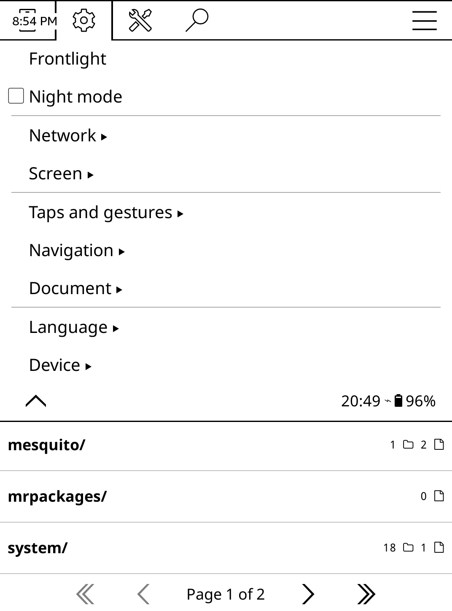

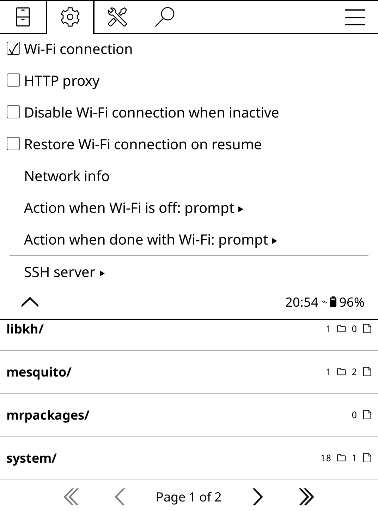
</div>

I'm going to setup my SSH key on the Kindle so that I can connect to my Kindle in a more secure manner. 

1. I first need to temporarily enable "Login without password (DANGEROUS)" on my Kindle. This will allow me to connect to the Kindle via SSH with a blank password.
2. Then, I will start the SSH server by clicking on the "SSH Server" menu item. You will get a popup on your Kindle that displays its IP address; I need it for the next step.
   <div class="c-image-gallery" markdown="1">
   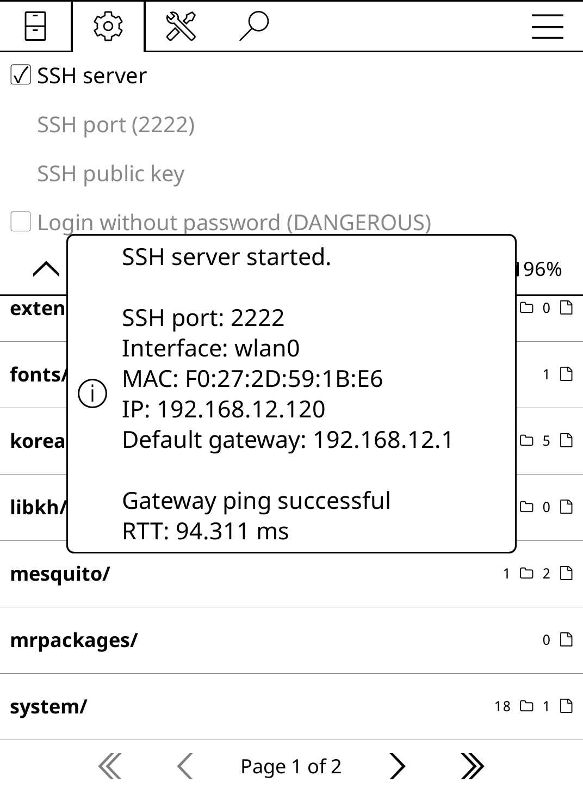
   </div>
3. I can now connect via SSH. The connection details are as follows,
   * Host: Your Kindle's IP address from step 2, for me it was 192.168.12.120.
   * username: root
   * password: \<leave empty>
4. My SSH command looked like so,

```
$ ssh root@192.168.12.120 -p 2222
#################################################
#  N O T I C E  *  N O T I C E  *  N O T I C E  #
#################################################
Rootfs is mounted read-only. Invoke mntroot rw to
switch back to a writable rootfs.
#################################################
[root@kindle root]# mntroot rw
```

Upon connecting, I'm greeted by this notice that essentially tells me, "consider your current session as read-only, if you want to make edits to any files, (which we do), run this command." I want to be able to save my public key on the Kindle so that we can use it to SSH in; therefore we need to make the filesystem writeable. 

```
# mntroot rw
system: I mntroot:def:Making root filesystem writeable
```

Now I need to find my Kindle's `authorized_keys` file, which is located at, `/mnt/us/koreader/settings/SSH/authorized_keys`. Like most light-weight systems, the only text editor available is `vi` so be sure to know how to exit once you're done.

Paste your public key into your `authorized_keys` and exit your SSH session. Go back to your Kindle and shut down your SSH server. Earlier, I enabled "Login without password." Now, it's time for me to turn it off and I should be able to login with my SSH key.

To verify that updating my `authorized_keys` worked correctly, I'll add a `-v` to my SSH command and read the logs of which public key is accepted by my Kindle (I have several keys on my computer).

```
$ ssh root@192.168.12.120 -p 2222 -v

... lots of output ...

debug1: Offering public key: /Users/allejo/.ssh/id_ed25519 ED25519 SHA256:9S2ld7G9EZXqIbqXKvosAKA74Xj1rDaOP9Gpx4pvdIQ
debug1: Server accepts key: /Users/allejo/.ssh/id_ed25519 ED25519 SHA256:9S2ld7G9EZXqIbqXKvosAKA74Xj1rDaOP9Gpx4pvdIQ
Enter passphrase for key '/Users/allejo/.ssh/id_ed25519':
```

The "Server accepts key:" is the important line that we're looking for. This means that my Kindle recognizes my SSH key and will allow me to log in once I unlock my key. Now, I can use my favorite SFTP client to connect to my Kindle in a secure manner. If I want to see the equivalent of my Kindle's "root," i.e. the filesystem I see when I connect my Kindle to my computer with a micro-USB cable, that's mounted at `/mnt/us/`.

## Screenshots

Another feature I was oddly excited for was the ability to take screenshots! Okay, so Kindles have had the ability to [take screenshots since at least 2020](https://www.toptrix.net/2020/05/most-useful-kindle-tools-services.html), but it's such a bad experience. The gesture isn't difficult, but for the life of me, I cannot tap both corners at the same time. And let's say I do manage by chance, the screen flashes white and that's it. But you know what else that looks like? Your Kindle repainting its entire screen. There's no notification at all that my screenshot was successful.

But KOReader gets it right! Its default gesture for screenshots is a long one-finger diagnol swipe. I swipe from a top corner to its diagonal bottom corner and I get this notification that my screenshot was taken.

<div class="c-image-gallery" markdown="1">
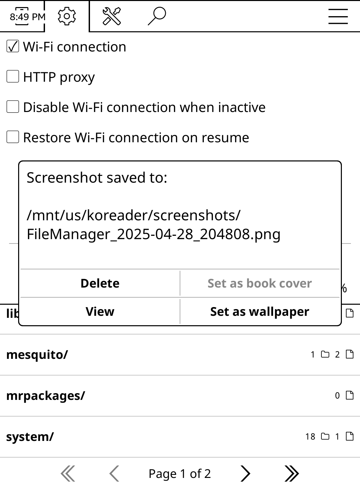
</div>

And since I can SFTP to my Kindle at any time, I can easily view those screenshots on my computer. And since KOReader providers a file browser, I can go find my screenshots at `/mnt/us/koreader/screenshots/` and view them on my Kindle itself!

## Add a Dictionary

My KOReader installation did not have a dictionary installed by default; I'm not sure if I configured it like that, or this is expected. There are two methods of installing dictionaries, through tne KOReader top menu and by transferring dictionaries manually.

<div class="c-image-gallery" markdown="1">
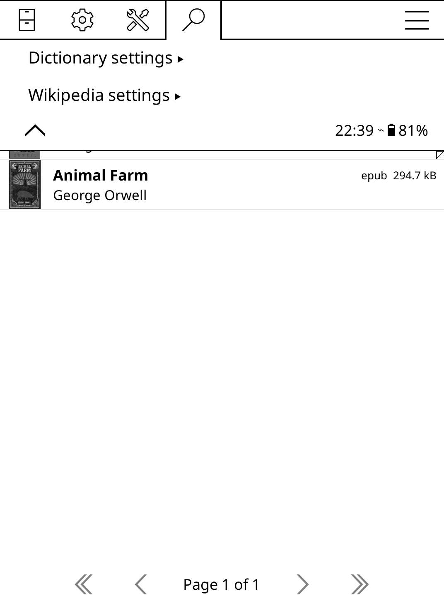

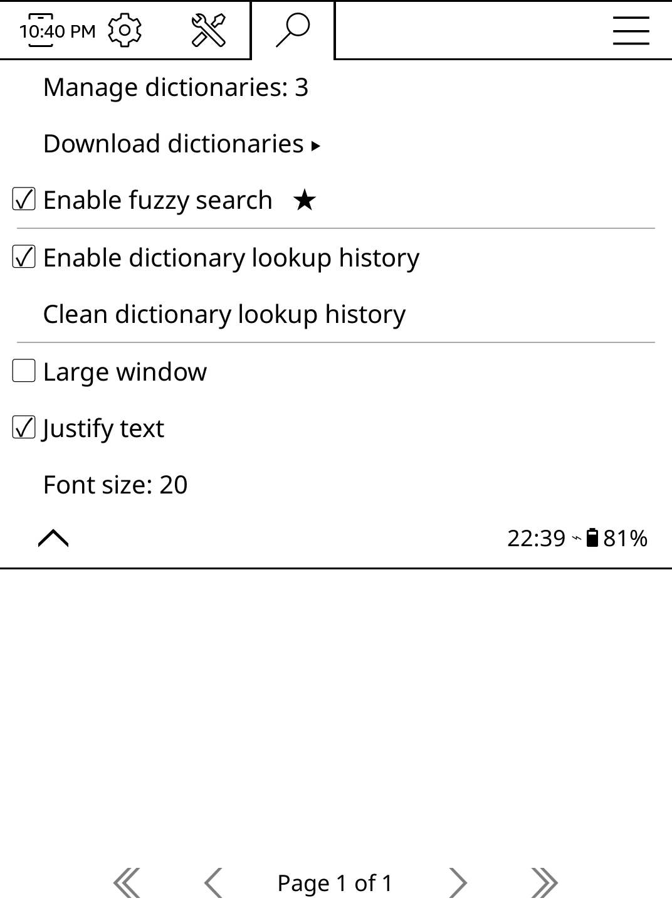
</div>

### Through KOReader's Top Menu

The first option is to install a dictionary from inside of KOReader. Navigate to the Search menu (the magnifying glass), Settings, Download Dictionaries. The annoying part about this method is that there are 20 pages worth of dictionaries that you need to flip through to. "E" for "English" is early on in the alphabet, so it's on page 4 for me.

<div class="c-image-gallery" markdown="1">
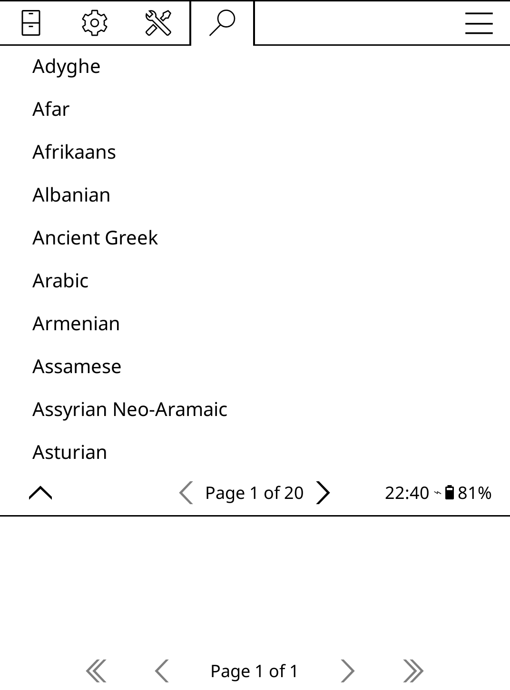

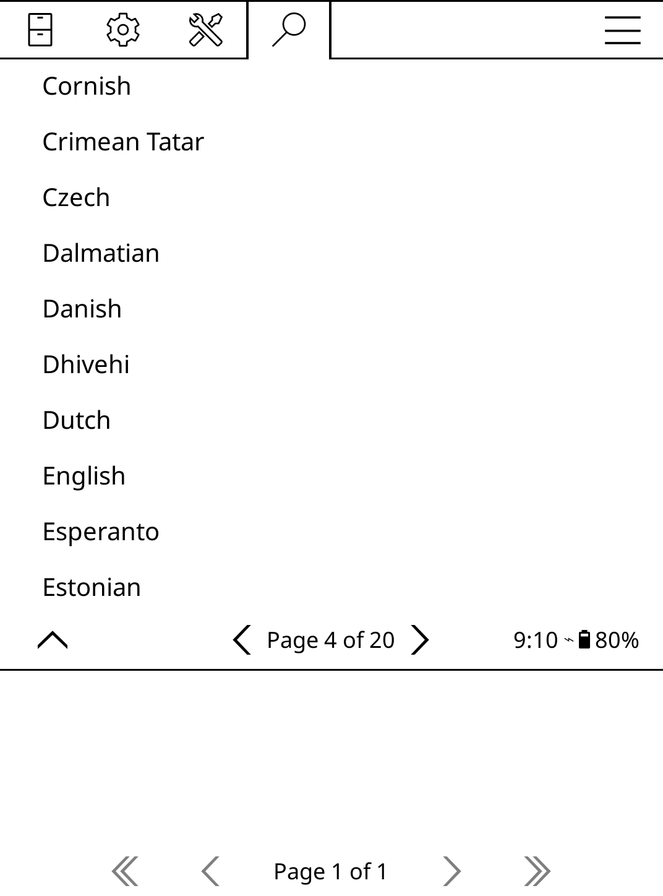
</div>

### Manually via SFTP (or wired)

My preferred approach is to do download dictionary bundles manually and copy them to my Kindle via SFTP (or wired, if you prefer). The dictionaries I downloaded and installed are based on daily dumps from [Wiktionary](https://www.wiktionary.org/); I got the English-only dictionary and an English-Spanish dictionary.

- [English Dictionary from Wiktionary](https://www.reader-dict.com/en/download/en) (i.e. `dict-en-en.zip`)
- [Bilingual Dictionaries from Wiktionary](https://download.wikdict.com/dictionaries/stardict/) (i.e. `wikdict-en-es.zip`)

KOReader supports dictionaries that are in the [StarDict](https://en.wikipedia.org/wiki/StarDict) format, which consists of extensions such as `*.idx`, `*.ifo` or `*.ifo.gz`, `*.dict` or `*.dict.dz`. The above links will download a ZIP file respectively that, when extracted, gives you folders with its StarDict files inside of said folders; extracting these ZIP files gave me the `dict-en-en` and `wikdict-en-es` folders.

KOReader requires dictionaries to be stored in `/mnt/us/koreader/data/dict` (or `/koreader/data/dict` when connected with a cable). Each dictionary requires two levels of folders, so I created two folders to store my downloaded dictionary: "WikDict Bilingual" and "Ebook Reader Dict;" I then put `wikdict-en-es` and `dict-en-en` in those folders respectively.

```
.
  |- GNU Collaborative International Dictionary of English
  |  |- gcide
  |  |  |- stardict.idx
  |  |  |- stardict.dict.dz
  |  |  |- stardict.syn
  |  |  |- stardict.ifo
  |  |  |- stardict.idx.oft
  |- WikDict Bilingual
  |  |- wikdict-en-es
  |  |  |- stardict.dict.dz
  |  |  |- stardict.idx
  |  |  |- stardict.ifo
  |  |  |- stardict.idx.oft
  |- Ebook Reader Dict
  |  |- dict-en-en
  |  |  |- dict-data.ifo
  |  |  |- dict-data.dict.dz
  |  |  |- dict-data.syn.dz
  |  |  |- res/
  |  |  |- dict-data.idx
  |  |  |- dict-data.idx.oft
```

After installing dictionaries, the `data/dict/` folder looks like the file tree show above. The "GNU Collaborative International Dictionary of English" folder was created automatically for me by KOReader. When I installed the English dictionary via the KOReader UI (what I talked about in the previous section), this is where it was stored.

## Exiting KOReader

One important thing to note is that while KOReader is running, it is impossible to connect your Kindle to your computer with a USB cable and transfer data to it. For me, this isn't really an issue since I setup SSH and I've been wanting to wireless manage my Kindle at my desk.

Now, I may not need to exit KOReader to transfer any books to it but it is useful to know how to exit an application; I'm looking at you, Vim. Exiting out of KOReader will return me to my stock Kindle UI; this will shut down or disable any of the features I mentioned like screenshots or SSH. The way I see it is KOReader is your enhanced "operating system" providing many useful services and integrations/apps. I intend on running KOReader 24/7 on my Kindle and treat it as a better OS.

<div class="c-image-gallery" markdown="1">
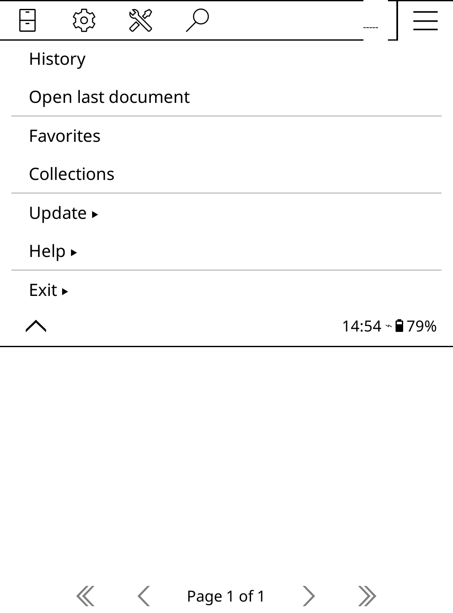

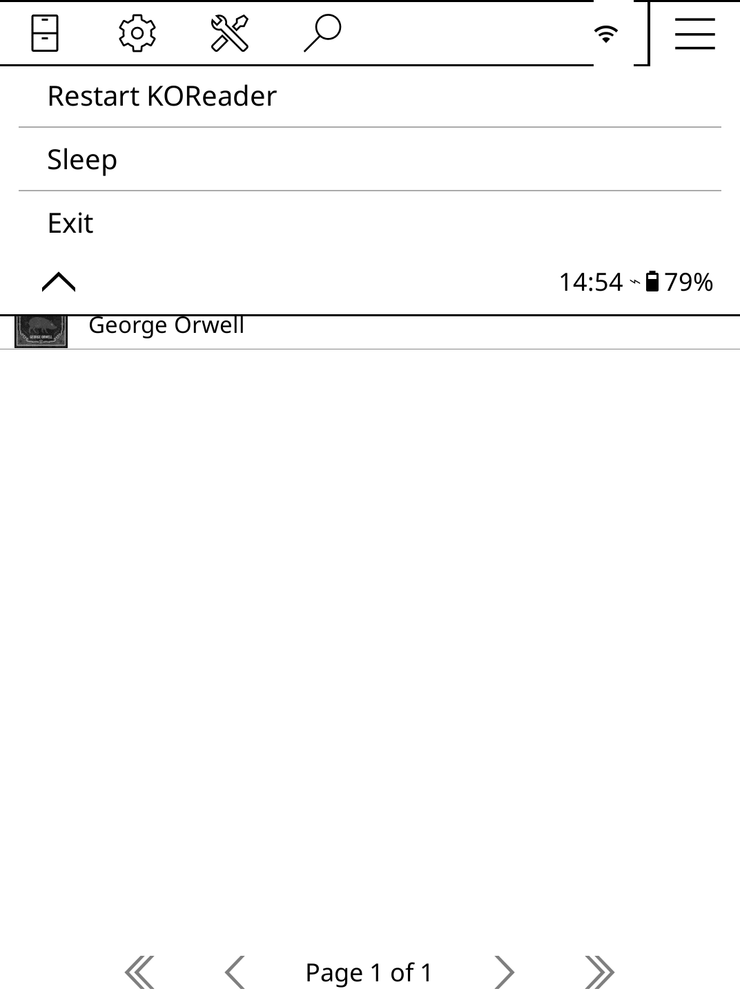
</div>

I click on the Main menu (the hamburger icon), click on Exit, and choose Exit once more to full shutdown KOReader.

## Next free weekend's task: integrating calibre

One of the most powerful feature that I'm excited about is its **wireless** integration with calibre! My tags, my genres, my collections, all of my hard work that I **own** finally able to integrate smoothly with my Kindle. Something Amazon would never support with it's incredibly shit excuse for a library UI on its website or within its apps. However, I have yet to fully learn about this feature and it will be a project for another weekend.

## That's It So Far

This was my first weekend project in many, many years. Life happens? Priorities shift? Depression? I don't know man, it's scary how it's been such a long time since I was motivated for a weekend project like this.
